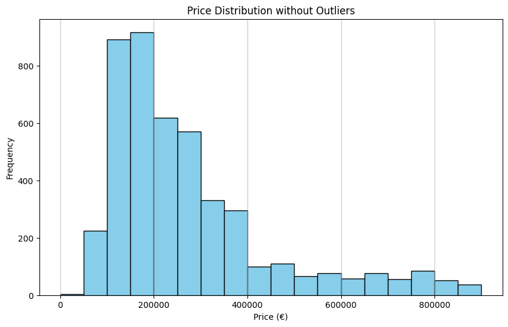

# PEC2. Visualización de datos
Se han desarrollado 3 visualizaciones en Python.

## Fuentes de datos
A continuación, se detallan las fuentes de datos de cada visualización:
- Histograma: https://www.kaggle.com/datasets/thedevastator/spanish-housing-dataset-location-size-price-and?resource=download
- Chloropeth map:
  - Datos geográficos: https://www.naturalearthdata.com/downloads/110m-cultural-vectors/110m-admin-0-countries/
  - Datos de densidad de población: https://www.kaggle.com/datasets/varpit94/world-population-density
- Marimekko: https://www.sepg.pap.hacienda.gob.es/sitios/sepg/es-ES/Presupuestos/DocumentacionEstadisticas/Estadisticas/Paginas/Estadisticas.aspx

## Instalación
Para instalar y probar el código:
1. Clonar el repositorio.
```
git clone https://github.com/LuisGF93/data_visualization_pec2.git
```
2. Crear entorno virtual o similar (recomendado.
```
python -m venv .venv
```
3. Instalar el fichero.
```
pip install -r requirements.txt
```
4. Seleccionar el kernel del entorno virtual en la herramienta utilizada.

## Resumen

### Visualización completa en HTML
Enlace a la visualización a través del navegador web
[Ver el Notebook](https://luisgf93.github.io/pec2_visualization/pec2.html)

### Visualización del Histograma:


### Visualización del Chloropeth map:
[Ver el mapa interactivo](https://luisgf93.github.io/pec2_visualization/assets/chloropeth_map.html)

### Visualización del Marimekko:


